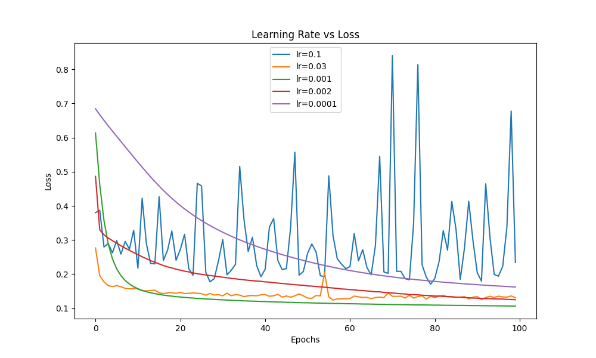
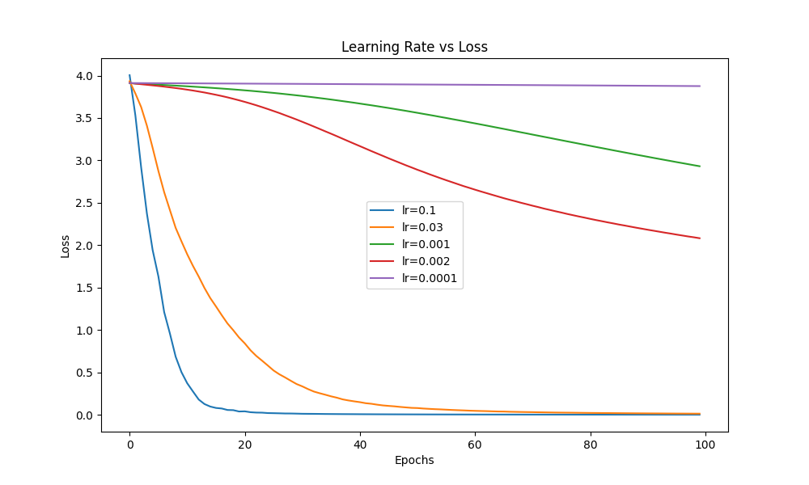

# CBOW and Skip-Gram Word Embedding Models

This repository contains Python implementations of two popular word embedding models: **CBOW (Continuous Bag of Words)** and **Skip-Gram**. These models are used to generate word embeddings, which are dense vector representations of words in a continuous vector space.

## Files

- **`pgm_cbow.py`**: Implements the CBOW model for word embeddings.
- **`pgm_skip.py`**: Implements the Skip-Gram model for word embeddings.

## Prerequisites

Ensure you have the following installed:
- Python 3.8+
- Required Python libraries: `numpy`, `keras`, `scikit-learn`

You can install the required libraries using:
```bash
pip install numpy keras scikit-learn
```

## Usage

### 1. Input Data
Both scripts expect an input text file named `input.txt` in the same directory. This file should contain the text corpus for training the models.

### 2. Running the CBOW Model
To train the CBOW model, run:
```bash
python pgm_cbow.py --learning_rate <float> --epochs <int> --batch_size <int>
```

#### Example:
```bash
python pgm_cbow.py --learning_rate 0.01 --epochs 50 --batch_size 32
```

#### Outputs:
- `cbow_dataset.csv`: Encoded dataset used for training.
- `vocab.txt`: Vocabulary with word frequencies.
- `loss_cbow.txt`: Training and validation loss per epoch.
- Console output: Top 5 most similar words to a user-provided word.

### 3. Running the Skip-Gram Model
To train the Skip-Gram model, run:
```bash
python pgm_skip.py --learning_rate <float> --epochs <int> --batch_size <int> --num_negatives <int>
```

#### Example:
```bash
python pgm_skip.py --learning_rate 0.01 --epochs 50 --batch_size 32 --num_negatives 5
```

#### Outputs:
- `skipgram_dataset.csv`: Encoded dataset used for training.
- `vocab.txt`: Vocabulary with word frequencies.
- `loss_skipgram.txt`: Training and validation loss per epoch.
- Console output: Top 5 most similar words to a user-provided word.

### 4. Testing Word Similarity
After training, both scripts allow you to test word similarity. Enter a word when prompted, and the script will output the top 5 most similar words based on the trained embeddings.

### Command-Line Arguments
| Argument          | Description                                   | Default Value |
|-------------------|-----------------------------------------------|---------------|
| `--learning_rate` | Learning rate for the optimizer               | `0.01`        |
| `--epochs`        | Number of training epochs                     | `100`         |
| `--batch_size`    | Batch size for training                       | `32`          |
| `--num_negatives` | (Skip-Gram only) Number of negative samples   | `10`          |

## Notes
- The `input.txt` file should contain plain text data. Punctuation marks like `,`, `.`, and `\n` are automatically removed during preprocessing.
- Both models save their respective training losses in `loss_cbow.txt` and `loss_skipgram.txt`.

## Example Workflow
1. Place your text corpus in `input.txt`.
2. Run `pgm_cbow.py` or `pgm_skip.py` with desired hyperparameters.
3. Check the output files for training results and vocabulary.
4. Test word similarity using the console prompt.

## Testing Learning Rates

The Skip-Gram and CBOW model was tested with different learning rates to observe their impact on loss reduction during training. Below are the results:






## License
This project is licensed under the MIT License. See the `LICENSE` file for details.